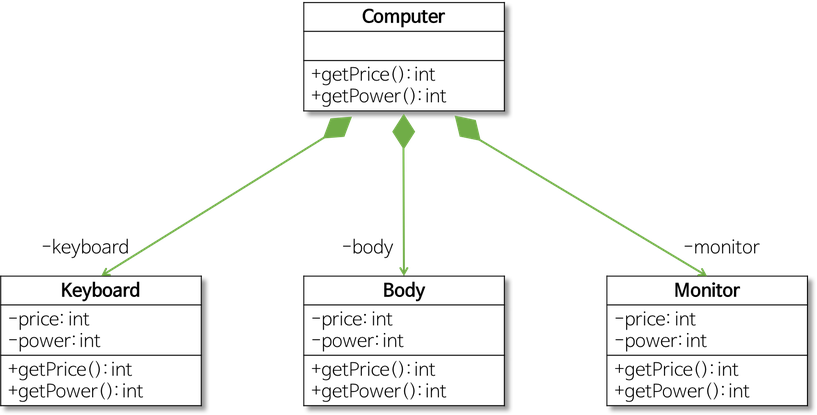
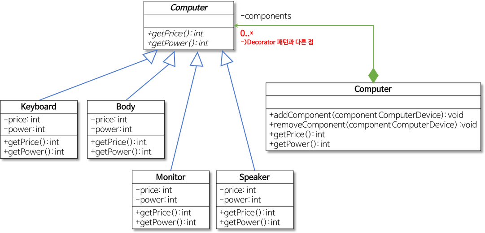

 

*[JAVA 객체지향 디자인 패턴](https://www.kyobobook.co.kr/product/detailViewKor.laf?mallGb=KOR&ejkGb=KOR&barcode=9788968480911) 도서를 참고한 내용임.*

  

### 구조적 형태의 전체와 부분의 유사성 - 컴퍼지트 패턴

Computer(전체)를 구성하는 Keyboard, Body, Monitor(부분)이 유사하다.

 

 

### 문제점

Interface를 활용하여 의존성 역전을 하지 않은 코드는 OCP를 위배할 수 밖에 없다.

Interface가 아니라 구체 클래스를 의존하는 클래스는 변경이 필요할 때, 수정을 피할 수 없기 때문이다.

따라서 여기서도 OCP를 위배했다고 책은 지적한다. (우리가 작성하고 있는 코드의 거의 대부분..(99%)은 OCP를 위배한다. )

### 해결책

문제점의 핵심은 Computer 클래스가 부품을 구현한 구체적인 클래스를 의존하기 때문이다.

우리는 이 전통적인 의존 방향성을 고쳐야 한다. 

 

 

이 그림을 다시보자. 의존 관계 화살표가 위에서 아래를 연결짓고 있다. (다이아몬드 모양은 전체를 나타낸다)

OCP를 만족시키기 위해서는 이 의존성 그래프를 뒤집어야 한다. (Dependency Inversion, 의존성 역전이라고 표현하는 이유이다.)

*잠깐, 의존성 역전의 정의를 보고가자.*

> 1. High-level modules should not depend on low-level modules. Both should depend on abstractions.
고수준 모듈은 저수준 모듈을 의존해서는 안된다. 둘다 추상화에 의존해야 한다.

> 2. Abstractions should not depend on details. Details should depend on abstractions.
추상화는 세부사항에 의존해서는 안된다. 세부사항이 추상화에 의존해야 한다.

1번이 하면 안된다고 했던 것이 바로 저 위에 의존성 그래프이다. (그리고 이것을 전통적인 방식이라고 표현한다.)

이 원칙을 지키지 않았기 때문에 OCP를 위배할 수밖에 없다. (OCP를 지키고자 나온 원칙 중 하나가 의존성 역전이기 때문)

다형성이라는 것은 해당 클래스가 다른 구체 클래스를 의존하고 있다면 올바르게 그 가치를 실현할 수가 없다. 

의존하고 있는 구체 클래스의 변경에 영향을 받기 때문에, 다양한 형태를 가지는 것이 제한되기 때문이다.

따라서 우리는 OCP 원칙을 고수하지 않으면 객체지향이 주는 가장 큰 가치를 누리지 못한다.

이제 의존성 그래프를 의존성 역전이 말하는 방식인 추상화에 의존하도록 변경해보자.

 

 

모든 저수준 모듈(Keyboard, Body, Monitor, Speaker)은 추상 클래스인 Computer (이탤릭체로 표기) 에 의존한다.

그리고 고수준 모듈이자 전체를 나타내는  Computer 구체 클래스 또한 추상클래스 Computer 에 의존하고 있다. 

이전의 전통적인 방식과 비교해보면 추상클래스 Computer가 추가됨에 따라 의존성 그래프가 기존에 가리키고 있던 구체 클래스 Computer가 아니라

새로운 추상 클래스로 향하고 있다. 또한 구체 클래스 Computer는 저수준 모듈 모두를 사용할 수 있지만, 실제로 저수준 모듈들과는 아무런 관련성이 없다. (다시 말해 의존성이 없다.)

이렇게 의존성 그래프가 원래 향하던 방향이 아니라, 새로운 추상 클래스(혹은 Interface)를 향하는 것을 역전되었다고 표현하는 것이다.

### 컴퍼지트 패턴

 

 

이탤릭체로 표기된 Component는 추상 클래스를 나타낸다.

이 추상 클래스의 오른쪽을 보면 0..* child 라고 표기된 부분이 보이는데, 이것은 Component 추상 클래스를 의존하여 생성된 여러개의 부분 객체를 Composite 클래스에서 사용하게 된다는 것을 의미한다. 

  
