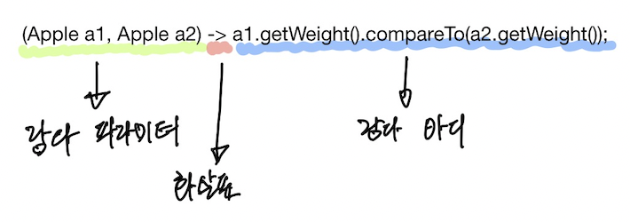

## 1. 메소드를 값으로 취급

```javascript
function withFoo(func) {
    const foo = function () {
        console.log('foo');
    };
    
    return function () {
        foo();
        func();
    };
}

const bar = withFoo(function () {
    console.log('bar');
}); 

bar();  // 'foo', 'bar'
```

javascript 에서 위와 같은 코드가 가능한 이유는 메소드를 값으로 취급하기 때문이다.<br/>
java 또한 8 버전 이후로 메소드를 값으로 사용할 수 있게 되었다.

<br/>

## 2. 메소드 참조

먼저 메소드 참조를 살펴보자.

메소드 참조와 람다가 등장하기 이전에는 동작 파라미터화(behavior parameterization)로 작성된 코드에서 취해야 하는 동작은 반드시 Class와 함께 구현해 주어야 했다.

아래 코드는 Class 를 선언 후 바로 인스턴스화 하여 코드가 비교적 간결해졌지만, 실행하고자 하는 동작이 `isHidden()` 인 것에 비하여 아주 많은 코드를 작성해 주어야만 했다.

```java
File[] hiddenFiles = new File(".").listFiles(new FileFilter() {
    public boolean accept(File file) {
      return file.isHidden();
    }
});
```

메소드 참조를 이용하면 코드가 어떻게 바뀔까?

```java
File[] hiddenFiles = new File(".").listFiles(File::isHidden);
```

File class가 가지고 있는 `isHidden` 메소드를 메소드 참조 문법을 사용하여 추가했다.

<br/>

### 2.1 메소드 참조란?

`File::isHidden`을 작성하면 `File` 클래스의 `isHidden` 메소드를 참조하게 되고,
런타임에 실제로 사용될 때에는 작성된 메소드 참조 코드를 기반으로 람다가 실행된다.

```java
interface File {
  boolean isHidden();
}
```

위의 인터페이스를 기반으로 이미 작성되어 있는 코드를 람다식으로 표현하여 특정 메소드만을 호출하는 문법이다.

*메소드 참조를 람다식으로 전환하는 방법은 다음 포스팅에서 자세히 알아보자.*

자바 8 부터 메소드는 일급값(first-class)으로 사용된다. 기존에 객체 참조를 이용해서 객체를 파라미터로 사용했던 것과 마찬가지로
메소드 참조를 이용하여 객체 내부의 함수만을 독립적으로 파라미터로 사용할 수 있게 되었다.

<br/>

## 3. 람다

아래 코드는 동작 파라미터화를 표현하는 기존 방식이다.

```java
File[] hiddenFiles = new File(".").listFiles(new FileFilter() {
    public boolean accept(File file) {
        return file.isHidden();
    }
});
```

익명 클래스를 사용하는 방식은 코드가 깔끔하지 않아서 가독성이 떨어지는 문제점이 있었다.<br/>
클래스를 인스턴스화 하는 부분이 포함되다 보니, 코드레벨에서 핵심 관심사를 인지하는데 어려움이 있다.

<br/>

### 3.1 람다란?

**람다 표현식**은 익명 클래스를 이용하는 방식을 단순화한 것이라고 볼 수 있다.<br/>
람다는 다음과 같은 특징을 가지고 있다.

- 익명
> 보통의 메소드와 달리 이름이 없다. 구현해야 할 코드에 대해 이름에 대한 고민을 하지 않아도 된다.

- 함수
> 람다는 메소드와는 달리 특정 클래스에 종속되지 않는다.

- 전달
> 람다 표현식을 메소드 인수로 전달하거나 변수로 저장할 수 있다.

- 간결성
> 익명 클래스처럼 관심사가 아닌 코드들을 작성할 필요가 없다.

<br/>

### 3.1 람다 사용법

기존에 익명 클래스를 이용하여 비교식을 만드는 방식이다.

```java
Comparator<Apple> byWeight = new Comparator<Apple>() {
    public int compare(Apple a1, Apple a2) {
        return a1.getWeight().compareTo(a2.getWeight());
    }
}
```

다음은 람다를 이용한 방식이다.

```java
Comparator<Apple> byWeight =
    (Apple a1, Apple a2) -> a1.getWeight().compareTo(a2.getWeight());
```

익명 클래스와 관련된 코드들이 모두 걷어내졌고, 비교를 수행하는 로직만이 남게 되었다.
마치 자바스크립트의 Arrow function 과 비슷해 보인다. 

중요한 것은 비교를 수행하는데 필요한 코드를 직접적으로 표현하고 전달할 수 있게 되었다는 점이다.



람다는 위와 같이 파라미터, 화살표, 바디로 이루어져 있다. <br/>
다음은 자바 8의 유효한 람다 표현식의 일부이다.

```java
(String s) -> s.length()

(Apple a) -> a.getWeight() > 150

// {} 기호를 사용할 수 있다.
(int x, int y) -> {
    System.out.println("result:");
    System.out.println(x + y);
}

() -> 42

(Apple a1, Apple a2) -> a1.getWeight().compareTo(a2.getWeight())
```

<br/>

### 3.2 어디에, 어떻게 람다를 사용할 수 있나?

람다의 간단한 문법을 적극 사용하고 싶다.<br/>
어디에, 어떻게 사용할 수 있을까?

람다는 **함수형 인터페이스**를 인수로 받는 메소드에만 람다 표현식을 사용할 수 있다.

<br/>

#### 3.2.1 함수형 인터페이스

함수형 인터페이스란 하나의 추상 메소드만을 가지는 인터페이스를 말한다.<br/>
아래와 같은 모습이다.

```java
public interface Predicate<T> {
    boolean test(T t);
}
```


다음은 함수형 인터페이스 일까?

```java
public interface Cafe {
    String getName();
    boolean isOpen();
}
```

함수형 인터페이스가 아니다. 둘 이상의 추상 메소드를 가지고 있기 때문이다.

<br/>

#### 3.2.1.1 @FunctionalInterface 어노테이션

`@FunctionalInterface`는 함수형 인터페이스임을 가리키는 어노테이션이다.<br/>
실제로 함수형 인터페이스가 아니면 컴파일 에러를 발생시키므로, 적극 활용한다면 컴파일 타임에 실수를 방지할 수 있다.

<br/>

자바에서 람다의 정의와 사용 방법에 대하여 알아보았다.<br/>
다음 포스팅에서는 코드레벨에서 람다를 실제로 적용해볼 것이다.

<br/>

**이 포스팅은 *라울-게이브리얼 우르마*, *마리오 푸스코*, *앨런 마이크로프트*가 지은 [모던 자바 인 액션](http://www.kyobobook.co.kr/product/detailViewKor.laf?ejkGb=KOR&mallGb=KOR&barcode=9791162242025) 을 참고했다.**

<br/><br/>
