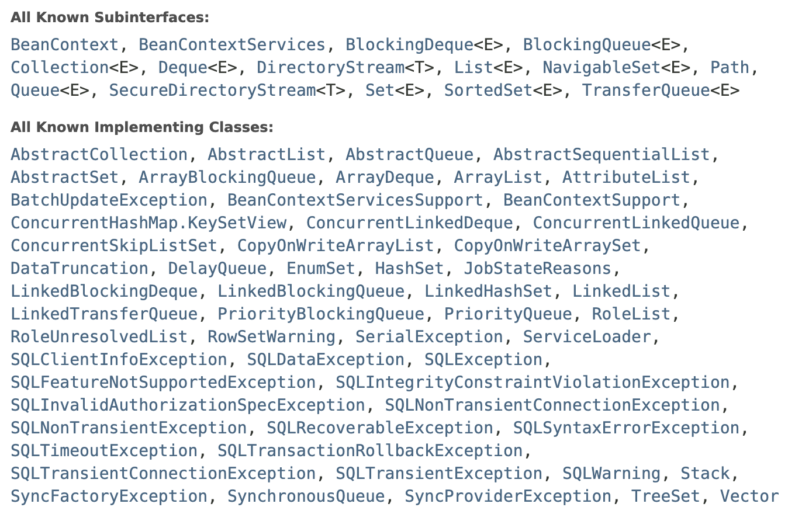
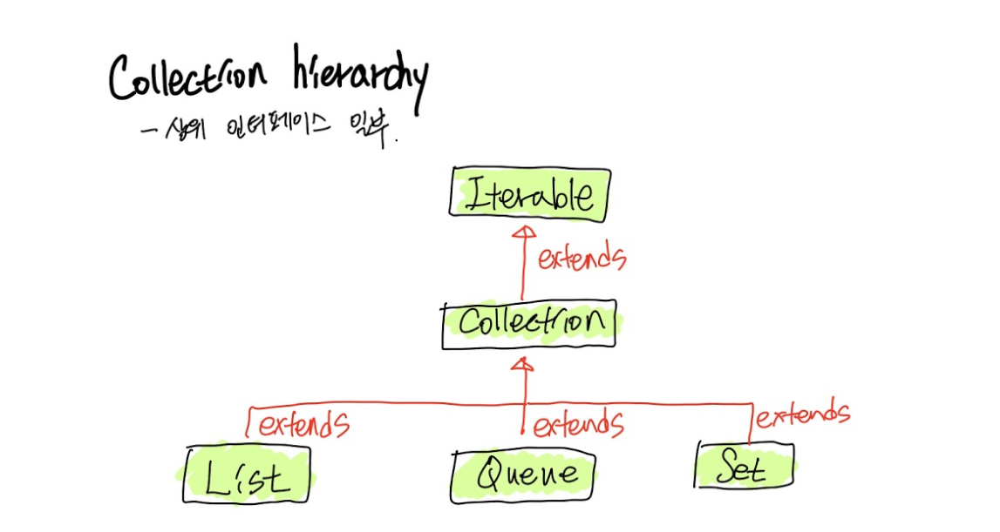
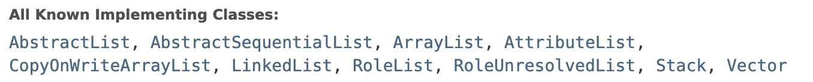

Java 에는 원소를 저장할 수 있는 (혹은 저장할 수 있을 것 같은 이름의) 자료구조가 굉장히 많이 있다.<br/>
어렴풋이 아는 것은 이제 그만하기로 하고, (나름) 제대로 파악해보자.

# [List](https://docs.oracle.com/javase/8/docs/api/java/util/List.html)

```java
public interface List<E> extends Collection<E> {
    // ...
}
```

List 는 Interface 이다. 그런데, Collection 을 확장하고 있다..! 순서를 잘못 잡은 듯 하다.<br/>
Collection 부터 살펴보자.


# [Collection](https://docs.oracle.com/javase/8/docs/api/java/util/Collection.html)

```java
public interface Collection<E> extends Iterable<E> {
    // ...
}
```

Collection 또한 Interface 이다. 그런데, Iterable 을 확장하고 있다.. 역시나 순서를 잘못 잡은 듯 하다.<br/>
Iterable 로 이동해보자.

# [Iterable](https://docs.oracle.com/javase/8/docs/api/java/lang/Iterable.html)

```java
public interface Iterable<T> {
    // ...
}
```

드디어 가장 첫 뿌리가 나왔다. Iterable 은 Interface 이다.<br/>
Iterable 은 T 타입의 Generic 을 함께 받도록 되어있는데, 이것은 iterator 에 의해 반환될 원소들의 타입이 된다.

Iterable 인터페이스를 구현하는 것은 객체가 for-each loop 선언문의 타겟이 되도록 하는 것이라고 한다.<br/>
for-each loop 의 타겟이라? 그게 뭘까.

---

## [for-each loop](https://docs.oracle.com/javase/8/docs/technotes/guides/language/foreach.html)

```java
// Fixed, though a bit ugly
for (Iterator i = suits.iterator(); i.hasNext(); ) {
    Suit suit = (Suit) i.next();
    for (Iterator j = ranks.iterator(); j.hasNext(); )
        sortedDeck.add(new Card(suit, j.next()));
}
```

아직 `Iterator`를 살펴보지는 않았지만, 반복을 수행하는 자료구조다 라고 생각하고 일단 봐보자.<br/>
특별히 문제는 없지만, 주석에서 보듯이 코드가 약간 못생겼고, `NoSuchElementException` 을 피하기 위해 `Suit` 객체를 내부 반복문의 밖에서 선언해 담아 두는 등, 신경 쓸 부분이 많이 있다.

for-each loop 구조로 어떻게 개선할 수 있을까?

```java
for (Suit suit : suits)
    for (Rank rank : ranks)
        sortedDeck.add(new Card(suit, rank));
```

일단, 반복자 `i` 가 사라졌다. 반복 할 수 있는 형태의 `suits` 변수를 곧바로 `Suit` 객체로 받아내고 있다.
물론 소프트웨어에서 마법이란 존재할 수 없으므로 (단지 감춰진 것일 뿐) for-each 구조에 의해 실행되는 코드에 대해서 내부적으로 반복자를 사용하고 있다는 것을 추측할 수 있다.

중요한 점은 기존 for-i 구조의 반복문을 사용할 때 고려해야 했던 많은 부분들과 못생긴 코드들을 상당히 개선할 수 있다는 점이다.

그렇다면 언제 for-each loop 를 써야할까? oracle docs 에서는 가능하다면 언제든지 쓰라고 말한다.<br/>

---

다시 돌아와서, Iterable 인터페이스를 구현하는 것은 구현된 객체가 for-each loop 를 실행할 수 있도록 하는 것이라고 생각할 수 있다.

Iterable 을 구성하고 있는 메소드들을 살펴보자. 

```java
public interface Iterable<T> {
    Iterator<T> iterator();

    default void forEach(Consumer<? super T> action) {
        Objects.requireNonNull(action);
        for (T t : this) {
            action.accept(t);
        }
    }

    default Spliterator<T> spliterator() {
        return Spliterators.spliteratorUnknownSize(iterator(), 0);
    }
}
```

Iterable 인터페이스는 `forEach` 함수를 default 메소드로 제공하고 있다.<br/>
내부적으로 앞서 살펴보았던 for-each loop 를 사용하고 있는 것이 보이고, 인자 `action` 에 대한 nonNull 검사도 보인다.

`iterator` 함수는 직접 구현해주어야 하는데, `Iterator` 타입을 반환하도록 되어있다.<br/>
`spliterator` 함수는 default 메소드로 제공하고 있고, 인터페이스 구현 시점에는 구현체가 될 `Iterator` 의 사이즈를 알 수 없기 때문에, `spliteratorUnknownSize` 라는 함수를 사용하고 있다. (`spliterator`는 다음에 자세히 알아보도록 하자.)

결론적으로, `Iterable` 은 `forEach` 함수를 제공하도록 설계된 인터페이스이다.<br/>
[oracle docs](https://docs.oracle.com/javase/8/docs/api/java/lang/Iterable.html) 를 살펴보면 `Iterable` 을 확장한 SubInterface 들과 잘 알려진 구현 클래스들이 나열되어 있다.<br/>




# (다시) [Collection](https://docs.oracle.com/javase/8/docs/api/java/util/Collection.html)

`Iterable` 은 이제 자신있다. (어렵다면 그냥 "아~ forEach 제공하는 인터페이스~" 하면 될 듯 하다. forEach 는 비교적 익숙하니까 쉽게 기억할 수 있겠다.)

`Collection` 인터페이스는 Collection hierarchy 상에 존재하는 루트 인터페이스이다.<br/>



Java 의 Collection hierarchy 중 일부의 모습이다.<br/>
`Collection` 은 hierarchy 중 두번째에 위치하고 있지만, 문서에서는 루트 인터페이스라고 표현하고 있다.

`Collection` 은 객체 그룹을 표현하는데, 어떤 컬렉션들은 중복된 요소를 허용하기도 하고, 일부는 그렇지 않기도 하다.<br/>
또 어떤 것들은 순서가 있고, 일부는 없다.<br/>

JDK 는 이 인터페이스를 직접 구현한 구현체는 제공하지 않는다. JDK 가 제공하는 구현체들은 `Set`과 `List` 같이 모두 더 구체적인 SubInterface 들을 구현하고 있다.

`Collection` 인터페이스는 보통 최대한 일반화를 보장하고 싶을 때 사용한다.

에를 들면, `List` 인터페이스를 구현한 `ListImpl` 과 `Set` 인터페이스를 구현한 `SetImpl` 구체 클래스가 있다고 해보자.
`foo` 라는 함수가 만약 두 구현체를 모두 처리하고 싶을 때, `Collection` 이 좋은 선택이 될 수 있다.

```java
public class ListImpl implements List<String> {
    // ...
}

public class SetImpl implements Set<String> {
    // ...
}

public class App {
    public static void main() {
        ListImpl listImpl = new ListImpl();
        SetImpl setImpl = new SetImpl();
        
        foo(listImpl);
        foo(setImpl);
    }

    public void foo(Collection<String> collection) {
        collection.add("foo");
    }
}
```

`List`와 `Set` 모두 `Collection` 인터페이스를 상속받은 인터페이스이기 때문에, 상위 인터페이스인 `Collection` 내에 존재하는 메소드들은 `List` 와 `Set` 이 모두 가지고 있다.

이러한 특징 때문에 일반적 목적으로 구현된 모든 `Collection` 구현체들은 SubInterface 를 구현함으로써 간접적으로 `Collection` 인터페이스를 구현하고 있다.

수많은 `Collection` 구현체들은 저마다 다른 exception 정책을 가지고 있다. 또한 멀티스레드 환경에서의 동기화 정책도 각 컬렉션 구현체에 의해 결정되기 때문에 구현체를 사용할 때에는 자세히 알아두어야 한다.

자, 이제 `Collection` 인터페이스가 제공하는 메소드들을 살펴보자.

```java
public interface Collection<E> extends Iterable<E> {
    int size();

    boolean isEmpty();

    boolean contains(Object o);

    Iterator<E> iterator();

    Object[] toArray();

    <T> T[] toArray(T[] a);

    default <T> T[] toArray(IntFunction<T[]> generator) {
        return toArray(generator.apply(0));
    }

    boolean add(E e);
    
    boolean remove(Object o);

    boolean containsAll(Collection<?> c);

    boolean addAll(Collection<? extends E> c);

    boolean removeAll(Collection<?> c);

    default boolean removeIf(Predicate<? super E> filter) {
        Objects.requireNonNull(filter);
        boolean removed = false;
        final Iterator<E> each = iterator();
        while (each.hasNext()) {
            if (filter.test(each.next())) {
                each.remove();
                removed = true;
            }
        }
        return removed;
    }

    boolean retainAll(Collection<?> c);

    void clear();

    boolean equals(Object o);

    int hashCode();

    @Override
    default Spliterator<E> spliterator() {
        return Spliterators.spliterator(this, 0);
    }

    default Stream<E> stream() {
        return StreamSupport.stream(spliterator(), false);
    }
    
    default Stream<E> parallelStream() {
        return StreamSupport.stream(spliterator(), true);
    }
}
```

`Iterable` 이 반복할 수 있는 최소한의 기능 (`forEach`) 를 제공했다면, `Collection` 은 그것에 더하여 추가, 삭제, 조회 등의 기능을 제공하고 있다.<br/>

또한 자바 8에 추가된 `stream` 자료구조로 변환하는 메소드도 제공하고 있다. 다시 말해, 기존 Collection hierarchy 내 구현체에서 Stream 으로 전환이 필요하다면, `Collection` 인터페이스는 무조건 구현되어 있어야 한다.

만약, `Collection` 인터페이스를 구현하여 사용할 일이 있다면, default method 는 동기화 프로토콜이 전혀 적용되어 있지 않다는 점을 기억하자. 따라서 특정한 동기화 프로토콜이 필요하다면, default 메소드의 구현체를 override 해야한다.

# (다시) [List](https://docs.oracle.com/javase/8/docs/api/java/util/List.html)

`Collection` 에서 이미 많은 기능들이 추가되었다. `List` 에는 또 무엇이 필요한걸까?<br/>

가장 먼저 눈에 띄는 특징은 `List` 는 순서가 있는 컬렉션이라는 것이다. 따라서 index 를 통하여 요소에 접근할 수 있고, 검색할 수 있다.<br/>

`List` 인터페이스는 리스트 요소들에 index 기반으로 접근할 수 있는 4가지 메소드를 제공한다.

- E get(int index)
- ListIterator<E> listIterator(int index)
- E set(index index, E element)
- List<E> subList(int fromIndex, int toIndex)

위 요소들을 통해 순서가 존재하는 `List` 인터페이스의 특징들을 잘 활용할 수 있겠다.<br/>
`ListIterator` 를 반환하는 `listIterator` 메소드는 `Iterator` 인터페이스가 제공하는 일반적인 기능들 외에도 요소 삽입(insertion), 대체(replacement), 양방향 접근(bidirectional access)을 제공한다.

양방향 접근(bidirectional access)이라는 표현이 좀 어려워보이니 한번 들여다보자.

`Iterator` 인터페이스는 다음과 같은 메소드를 제공하는 간단한 인터페이스다.

```java
public interface Iterator<E> {
    boolean hasNext();

    E next();

    default void remove() {
        throw new UnsupportedOperationException("remove");
    }

    default void forEachRemaining(Consumer<? super E> action) {
        Objects.requireNonNull(action);
        while (hasNext())
            action.accept(next());
    }
}
```

`Iterator` 인터페이스를 구현했다면 반복하는 당사자(iterator) 는 `hasNext()` 와 `next()` 메소드를 통해 제공되는 '다음 요소' 에 대한 정보만 알 수 있다.
반면에 `Iterator` 를 상속받은 `ListIterator`는 다음과 같은 인터페이스를 추가로 가지고 있다.

```java
public interface ListIterator<E> extends Iterator<E> {
    boolean hasNext();

    E next();

    boolean hasPrevious();

    E previous();

    int nextIndex();
    
    int previousIndex();

    void remove();

    void set(E e);

    void add(E e);
}
```

`hasNext()`, `next()` 뿐만 아니라 `hasPrevious()` 와 `previous()` 를 제공함으로써 '다음 요소' 뿐만 아니라, '이전 요소' 에 대한 정보도 알 수 있게 되었다. 즉, 양방향 접근이 가능하다.<br/>

> 이러한 기능이 제공될 수 있는 이유는 `List` 가 순서가 정해져있는 컬렉션이기 때문이 아닐까? 순서가 정해져 있지 않은 컬렉션이라는 개념이 잘 이해가 되지 않기 때문에 이 부분이 아직 모호하다. 추측하기로는 인터페이스 설계상으로는 순서가 정해져 있지 않은 컬렉션이 '이전 요소' 에 대한 접근을 할 수 있는 것이 모순? 이기에 제공하지 않는 것이 아닐까 싶다. (반면 반복할 수 있는(iterable) 요소들의 집합이 컬렉션이라는 점에서 '다음 요소'를 알아내는 것에는 개념적으로 문제가 없다.) 그러나 따져보면 런타임에는 순서가 정해져 있지 않은 컬렉션이더라도 이전 요소에 대한 정보를 알 수 있지 않을까? 단지 그러한 기능을 제공하지 않을 뿐이 아닌가 하는 생각이 든다. (너무 철학적인가..?)

`List` 인터페이스가 제공하고 있는 기능 중에서 일부를 살펴보자.

```java
public interface List<E> extends Collection<E> {
    // ...

    void add(int index, E element);

    E remove(int index);

    int indexOf(Object o);

    List<E> subList(int fromIndex, int toIndex);

    default void sort(Comparator<? super E> c) {
        Object[] a = this.toArray();
        Arrays.sort(a, (Comparator) c);
        ListIterator<E> i = this.listIterator();
        for (Object e : a) {
            i.next();
            i.set((E) e);
        }
    }
    
    // ...
}
```

기억해야 할 포인트는 `List` 인터페이스가 **순서가 결정된** 자료구조 라는 점이다. 순서가 결정되었기 때문에 위에서 보는 바와 같이 다양한 기능을 수행할 수 있게 되었다.
이제 `Collection<Book> books = /* */;` 와 같은 코드를 보고, `books` 를 어떻게 sorting 하지? 라던지 아니면 `books` 의 3번째 요소에는 어떻게 접근하지? 라는 생각은 하면 안된다. (지금까지는 매번 했다.)


JDK는 `Collection` 을 상속받은 `List` 를 구현한 많은 기본 구현체를 제공하고 있다.



인터페이스를 통해 큰 개념의 hierarchy 를 이해했다면, 상황에 맞는 적합한 구현체를 골라 사용하는 것이 중요하다.<br/>
다음엔 대표적인 `ArrayList` 와 `LinkedList` 를 비교분석해보겠다.


# References

- https://docs.oracle.com/javase/8/docs/api/java/util/List.html
- https://docs.oracle.com/javase/8/docs/api/java/util/Collection.html
- https://docs.oracle.com/javase/8/docs/api/java/lang/Iterable.html
- https://docs.oracle.com/javase/8/docs/technotes/guides/language/foreach.html
- https://www.scientecheasy.com/2020/09/collection-hierarchy-in-java.html/

